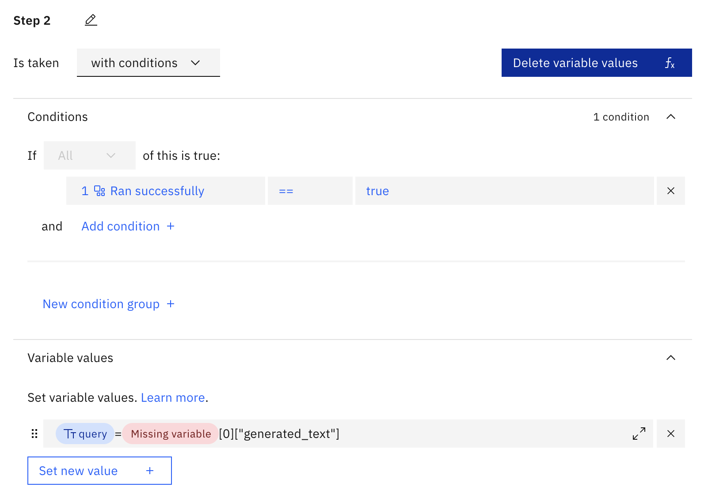

# watsonx-rag-elasticsearch

# 1. Index documents

Edit the notebook `watsonx-rag-elasticsearch.ipynb`, and update the required variables.

This notebook demonstrates,

- how to have fine grain control over the ingesting process such as chunking
- using pipelines to offload embedding text to Elasticsearch
- create an Elasticsearch index
- search for query terms using pipelines
- deploy and test prompts on Watson Machine Learning Deployment spaces

# 2. Setup watsonx Assistant

### 2.1 Create 3 variables


1. `query` of text type
2. `context` of any type
3. `history` of any type

### 2.2 Create 2 custom extensions

1. Elasticsearch 
    - Upload `elasticsearch-openapi.json` for the Elasticsearch custom extension
    

    - Configure credentails
    

2. watsonx.ai
    - Upload `watsonx-deployment-history.json` for the watsonx.ai custom extension
    

    - Configure credentials
     

### 2.2 Create a new Action (select Start from scratch option)

1. Set `query` variable to `input.text`. 

Copy and paste the expression, `${query} = input.text`, in the `Set variable section`.




2. In the `And then section`, select use an extension.

- Select the elasticsearch extension that was created in Step 2.2.
- Select the `Search request` operation.
- Under parameters, fill in the `index_name` that was used in Step 1.
- Under optional parameters, fill in the `knn`, `fields` and `source` fields.

For `knn`,
```json
{
    "field": "text_embedding",
    "query_vector_builder": {
        "text_embedding": {"model_id": "intfloat__multilingual-e5-base", "model_text": ${query}}
    },
    "k": 5,
    "num_candidates": 50
}
```
Note: set `model_id` according to the embedding model used in Step 1.

For `fields`, fill in `["text"]`

For `source`, select False.


3. Click on `New step +`

Set `context` variable based on the Elasticsearch results.

Copy and paste the below expression in the `Set variable section`.

```
${context} = "\n<documents><document>\n" + ${step_181_result_1.body.hits.hits}.joinToArray("%e.fields.text[0]%").join("\n</document>\n\n<document>\n") + "\n</document></documents>\n"
```

Edit expression using the editor to select the correct step.


Copy and paste the below expression in the `Set variable section`.

```
${history} = ${system_session_history}.transform("role", "<|start_header_id|>user<|end_header_id|>\n\n", "<|start_header_id|>assistant<|end_header_id|>\n\n").joinToArray("%e.role%%e.content%").join("<|eot_id|>") + "<|eot_id|>"
```


In the `And then section`, select use an extension.

- Select the watsonx.ai extension that was created in Step 2.2.
- Select the `Text Generation Stream` operation.
- Under parameters, fill in the `deployment_id` that was create in Step 1, `version` to `2023-05-29`.
- Under optional parameters, set `parameters.prompt_variables.history` to the `history` variable.
- Under stream response, set `text` to `results[0].generated_text`


